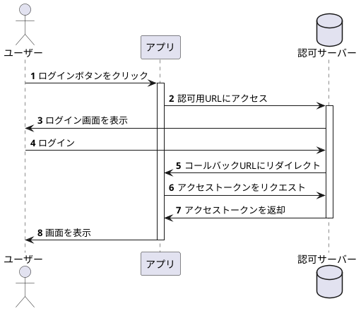
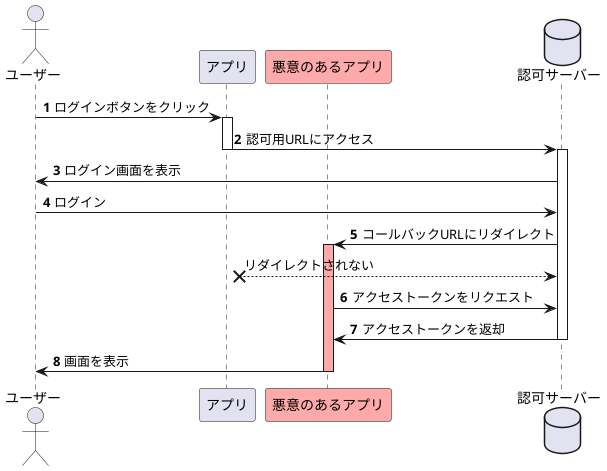
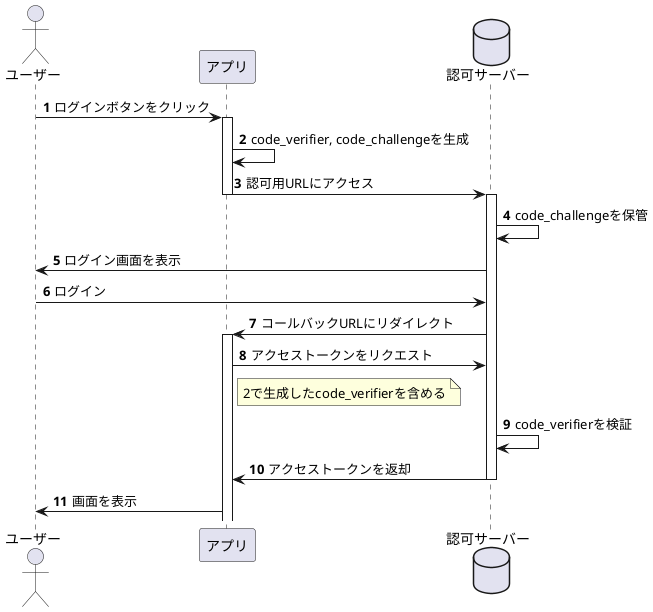
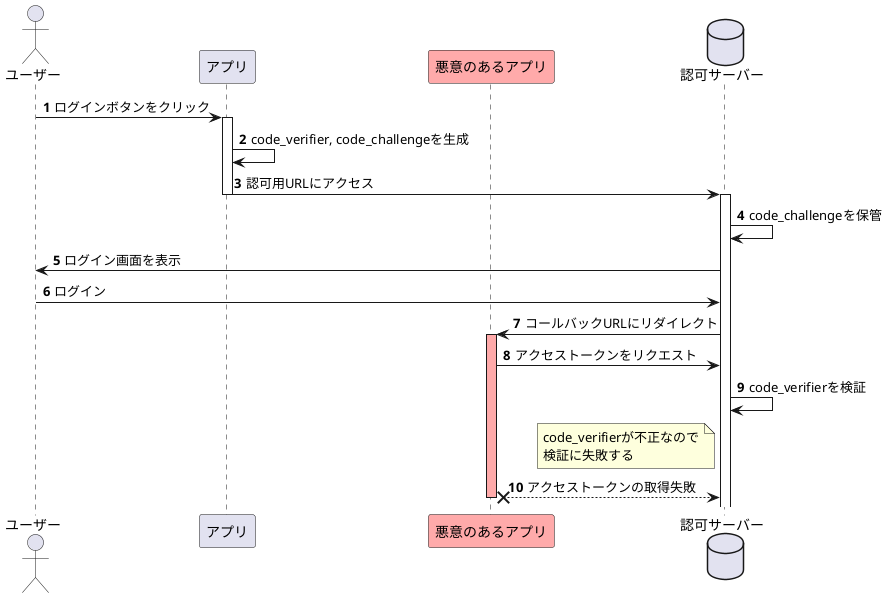

# README

## 認可フロー

### 1-a. 一般的に想定される認可フロー



### 1-b. 悪意のあるアプリによる攻撃フロー



### 2-a. PKCE対応の認可フロー



### 2-b. PKCE対応における攻撃フロー



### Usage

```ruby
code_verifier = SecureRandom.alphanumeric(64)
code_challenge = Base64.urlsafe_encode64(OpenSSL::Digest::SHA256.digest(code_verifier), padding: false)
```

See: https://qiita.com/nobuo_hirai/items/0fdd27d3a43161815da5